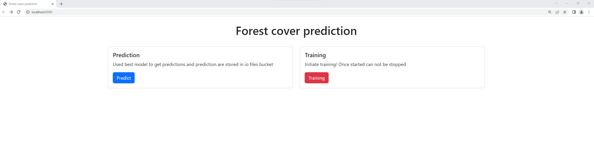
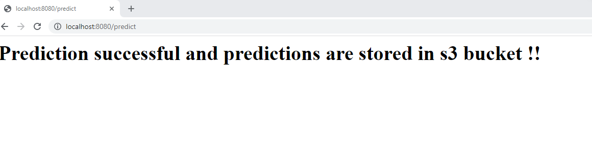
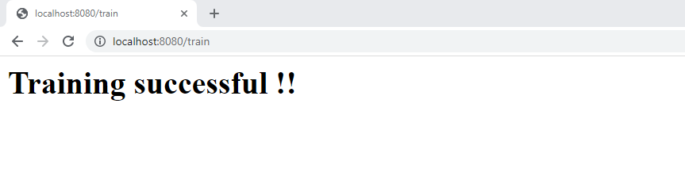
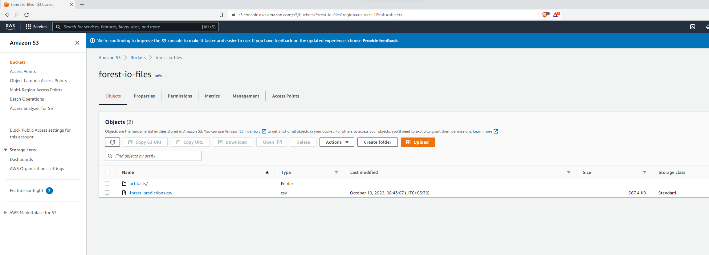
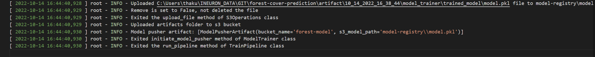

<h1 align="center">Forest Cover Type Prediction </h1>

<h5>  We need predict the forest cover type (the predominant kind of tree cover) from strictly cartographic variables (as opposed to remotely sensed data).
 The actual forest cover type for a given 30 x 30 meter cell was determined from US Forest Service (USFS) Region 2 Resource Information System data. 
 </h5>

 </br>
    Dataset url: [Kaggle](https://www.kaggle.com/competitions/forest-cover-type-prediction/data) 
</br>

##   <b>Built With</b>

- Python
- FastAPI
- Machine learning
- Docker
- Mongodb

## 🌐 Infrastructure Required.

1. AWS S3
2. AWS EC2
3. AWS ECR
4. Git Actions
5. Terraform

 ## <b> Snippets </b>
 <b>FlowChart</b>











##  <b> Data Understanding</b>

The dataset used to predict stroke is a dataset from Kaggle. This dataset has been used to predict student performance with  different model algorithms. This dataset has:
- 581012 samples or rows
- 55 features or columns 
- 1 target column (Cover_Type).


## 💻 How to setup:

### Quick Start

#### Windows:
```bash
deploy.bat
```

#### Linux/Mac:
```bash
chmod +x deploy.sh
./deploy.sh
```

This will:
- ✅ Check Python installation
- ✅ Install dependencies
- ✅ Create `.env` file
- ✅ Build Docker image (optional)
- ✅ Set up directories

### Manual Setup

Creating conda environment
```
conda create -p venv python==3.8 -y
```

activate conda environment
```
conda activate ./venv
```

Install requirements
```
pip install -r requirements.txt
```

Export the environment variable
```
export AWS_ACCESS_KEY_ID=<AWS_ACCESS_KEY_ID>

export AWS_SECRET_ACCESS_KEY=<AWS_SECRET_ACCESS_KEY>

export AWS_DEFAULT_REGION=<AWS_DEFAULT_REGION>

export MONGODB_URL="mongodb+srv://<username>:<password>@cluster.mongodb.net/?retryWrites=true&w=majority"

```
Run the live server using uvicorn
```
python app.py
```
To launch ui
```
http://127.0.0.1:8080/
```

## 🚀 Deployment

This project includes complete CI/CD pipeline and infrastructure as code:

### Documentation
- 📖 [SETUP.md](./SETUP.md) - Complete setup guide
- 🚀 [DEPLOYMENT.md](./DEPLOYMENT.md) - Deployment instructions
- ✅ [CHECKLIST.md](./CHECKLIST.md) - Pre-deployment checklist

### Cloud Deployment
1. Configure GitHub Secrets (AWS credentials, MongoDB URL)
2. Create S3 bucket for Terraform state: `aws s3 mb s3://sensor-tf-state --region us-east-1`
3. Push to main branch - GitHub Actions will automatically:
   - Build Docker image
   - Push to AWS ECR
   - Deploy to EC2 instance

### Infrastructure
- **Terraform** - Complete IaC setup for AWS resources
- **GitHub Actions** - Automated CI/CD pipeline
- **Docker** - Containerized deployment
- **AWS EC2** - Application hosting
- **AWS ECR** - Docker image registry
- **AWS S3** - Model and data storage

## 🏭 Industrial Use-cases 
1. Scientists can predict future wild fires & hence can save flora and fona.
2. Fire Rating Systems can be developed. 

 ## <b> Languages & Libraries Used</b>


 
<p>
<a></a>
 <a></a>
<a></a>
  <code>  </code>
  <code>  </code>
  <code>  </code>
  <code>  </code>
  <code>  </code>
  <code>  </code>
  <code>  </code>
</p>
